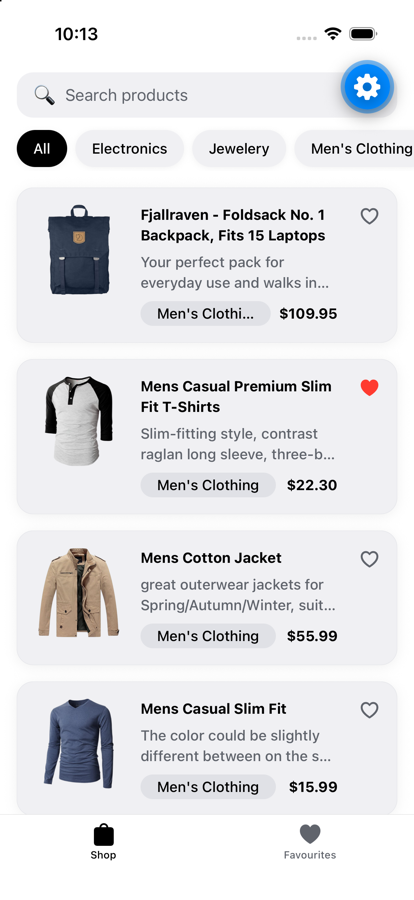
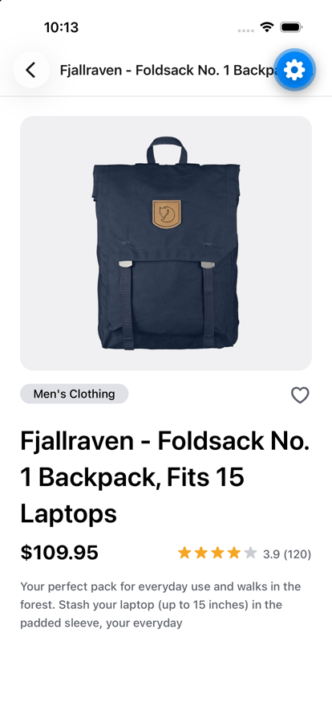
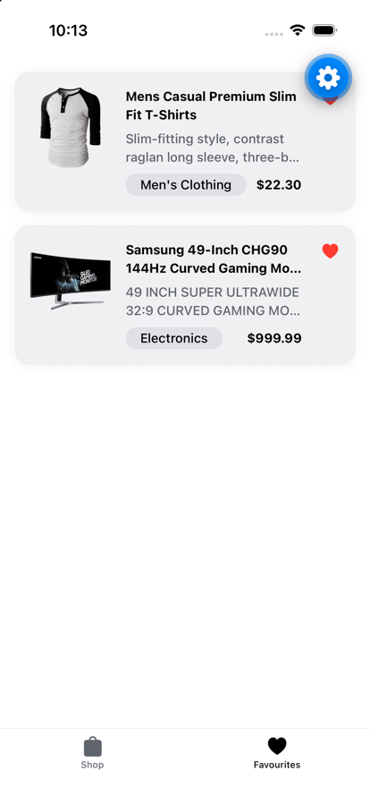
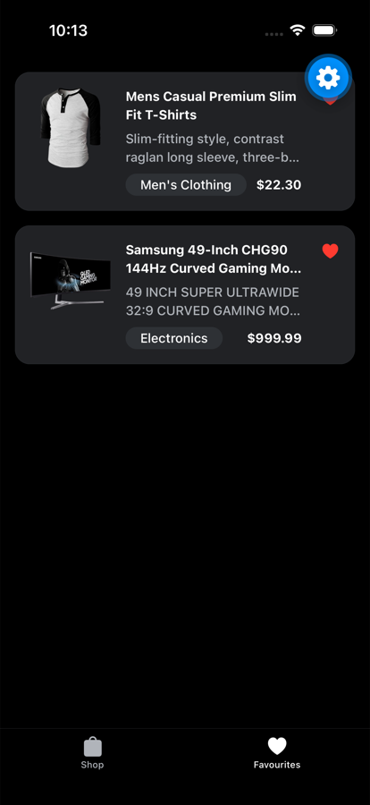

# Bountip — Product Catalogue

A small, production-minded React Native product catalogue built on the public
[Fake Store API](https://fakestoreapi.com/products). Browse products, search and
filter by category, view details, and save favourites — with proper loading,
empty, error and offline states throughout.

Built with **Expo (SDK 57) + expo-router**, **TypeScript**, **Redux Toolkit**
(client state) and **TanStack React Query** (server state).

---

## Features

**Browse & discover**

- **Product list** — a fast `FlatList` of cards showing image, title, price, a category chip and a description preview.
- **Infinite scroll** — the list pages in more products as you scroll (client-side, via TanStack `useInfiniteQuery`; see [Pagination](#pagination)).
- **Product details** — full image, title, description, price, category and a star rating (with half-stars).
- **Search** — debounced, case-insensitive search by title.
- **Category filtering** — horizontal, scrollable category tabs with an "All" option.

**Reliable feedback states**

- **Initial loading** — skeleton cards sized to match the real rows (no layout shift).
- **Empty states** — distinct copy for no search results, an empty catalogue, and empty favourites.
- **Error handling** — a typed error layer tells offline apart from server and parse errors, with a Retry that actually recovers.
- **Not found** — an unknown product id shows a dedicated screen instead of an endless retry (see [API](#api)).
- **Pull-to-refresh** — refetch the catalogue from the list.

**Performance & offline**

- **Image caching** — persistent disk caching, so images never re-download on scroll or revisit, and recycled rows never flash the wrong image (see [Image caching](#image-caching)).
- **Offline reads** — the catalogue is cached and browsable offline, with a dismissible offline banner.
- **Favourites** — a dedicated tab, persisted across launches.

**Polish & quality**

- **Dark mode** — follows the system appearance.
- **Haptics** — light feedback on category selection and favourite toggles.
- **Accessibility** — roles, labels and selected-state on every interactive element.
- **Tested & linted** — 30 unit + integration tests (Jest + RNTL), TypeScript strict, and a CI pipeline.

## Screenshots

_Running in Expo Go on an iOS simulator (iPhone 17)._

| Product list | Product details | Favourites | Dark mode |
| --- | --- | --- | --- |
|  |  |  |  |

## Tech stack

| Concern           | Choice                                             |
| ----------------- | -------------------------------------------------- |
| Framework         | Expo SDK 57, React Native 0.86, React 19           |
| Language          | TypeScript (strict)                                |
| Navigation        | expo-router (file-based, typed routes)             |
| Server state      | TanStack React Query (+ AsyncStorage persistence)  |
| Client state      | Redux Toolkit (`createSlice`) + redux-persist      |
| Data fetching     | `fetch` with a typed error layer (no axios)        |
| Images            | expo-image (memory-disk cache + recycling)         |
| Testing           | Jest, React Native Testing Library                 |
| Tooling           | ESLint (eslint-config-expo), GitHub Actions        |

## Requirements

- **Node 20+**
- **Yarn** (this repo uses `yarn.lock` as the single lockfile)
- The **Expo Go** app or an iOS/Android simulator/emulator

## Getting started

```bash
yarn install
yarn ios        # or: yarn android, or: yarn start (then press i / a / w)
```

`yarn start` opens the Expo dev server; scan the QR code with Expo Go or launch a simulator.

## Running tests

```bash
yarn test              # run the suite once
yarn test:watch        # watch mode
yarn test:coverage     # with a coverage report
yarn typecheck         # tsc --noEmit
yarn lint              # eslint
```

## Architecture

### State: React Query vs Redux

The one rule: **anything fetched from the server lives in React Query; anything
the user controls in the UI lives in Redux.** They never overlap.

| State                          | Owner                     | Why                                                   |
| ------------------------------ | ------------------------- | ----------------------------------------------------- |
| Products, product, categories  | **React Query**           | Server cache: loading/error, refetch, offline persist |
| Search text, active category   | **Redux** (`filters`)     | Pure UI state that drives client-side filtering       |
| Favourites                     | **Redux** (`favourites`)  | Client-only, persisted; no server round-trip          |
| Dark mode                      | System (`useColorScheme`) | Already provided by the OS + theme system             |

Using both libraries is deliberate, not redundant: React Query is a *server
cache* and Redux is a *client-state container*, so there is zero duplication —
no product ever lands in Redux, and no filter ever lands in the query cache.
A purist could ship this with React Query only; I use the split because it
gives favourites a persisted, testable home and keeps filtering logic out of
components. **RTK Query is intentionally not used** — it would duplicate
React Query.

### Folder structure

```
src/
  app/                 # expo-router routes (thin — logic lives in hooks/screens)
    _layout.tsx        # providers + root stack; product/[id] pushes over the tabs
    (tabs)/            # Shop + Favourites tabs
    product/[id].tsx   # shared details route
  api/                 # fetch client (typed ApiError) + product services
  components/          # reusable UI (product, filters, state views)
  hooks/               # queries/ (react-query) + filtering/debounce/haptics
  screens/             # screen components rendered by the routes
  store/               # redux slices, typed hooks, persisted store
  lib/                 # query client, formatting helpers
  types/               # Product domain types + runtime guard
  test-utils/          # renderWithProviders, fixtures, fetch mocks
```

### Image caching

Product images render through a small `ProductImage` wrapper around `expo-image`,
tuned for a scrolling catalogue:

- **`cachePolicy="memory-disk"`** — images are cached to disk, so they are never
  re-downloaded when you scroll back or reopen a product. The first view hits the
  network; every view after that is instant, online or offline. This is the core
  of the caching system.
- **`recyclingKey={product.id}`** — as `FlatList` recycles row views during
  scrolling, this key resets the image so a recycled card never briefly shows the
  previous product's picture.
- **`transition`** — a short fade-in as each image resolves.
- **Themed placeholder** — the image area uses `theme.backgroundElement` as its
  background, so nothing flashes white in dark mode before the image loads.
- **`onError` fallback** — Fake Store image URLs occasionally 404; the wrapper
  falls back to the neutral placeholder rather than rendering a broken image.

**Deliberately not built:** a manual `expo-file-system` cache with signed-URL
refresh logic. That layer only earns its place when an API serves *expiring*
(e.g. pre-signed S3) URLs — Fake Store serves static, public URLs, so
`expo-image`'s built-in disk cache is the whole story. Keeping it lean is a
conscious call, in line with the brief's "avoid over-engineering" guidance.

### Pagination

The Fake Store API has no server-side pagination — it returns all ~20 products in
one response and ignores `offset`, `skip` and `page` (verified with curl). So the
list uses **client-side pagination** with TanStack `useInfiniteQuery`:

- The full catalogue is fetched **once** (through `fetchQuery` against the shared
  products cache), then revealed in pages of 6 as the user scrolls (`FlatList`
  `onEndReached`), with a footer spinner while the next page appears.
- **Filtering runs on the complete set**, not just loaded pages, so search and
  category filters never miss items that a naive paginated approach would hide on
  unfetched pages. Changing a filter resets paging to the first page.

This keeps the infinite-scroll UX and real `useInfiniteQuery` semantics while
being honest about the API: no redundant network calls, and complete search results.

## API

The app uses the public [Fake Store API](https://fakestoreapi.com). Three
endpoints cover every screen — each is reproducible with `curl`. Responses below
are real (captured from the live API).

### List products — `GET /products`

```bash
curl -s "https://fakestoreapi.com/products?limit=2"
```

```json
[
  {
    "id": 1,
    "title": "Fjallraven - Foldsack No. 1 Backpack, Fits 15 Laptops",
    "price": 109.95,
    "description": "Your perfect pack for everyday use and walks in the forest. ...",
    "category": "men's clothing",
    "image": "https://fakestoreapi.com/img/81fPKd-2AYL._AC_SL1500_t.png",
    "rating": { "rate": 3.9, "count": 120 }
  }
]
```

### Single product — `GET /products/{id}`

```bash
curl -s https://fakestoreapi.com/products/1
```

```json
{
  "id": 1,
  "title": "Fjallraven - Foldsack No. 1 Backpack, Fits 15 Laptops",
  "price": 109.95,
  "description": "Your perfect pack for everyday use and walks in the forest. ...",
  "category": "men's clothing",
  "image": "https://fakestoreapi.com/img/81fPKd-2AYL._AC_SL1500_t.png",
  "rating": { "rate": 3.9, "count": 120 }
}
```

### Categories — `GET /products/categories`

```bash
curl -s https://fakestoreapi.com/products/categories
```

```json
["electronics", "jewelery", "men's clothing", "women's clothing"]
```

Note the upstream `jewelery` spelling — the app displays a title-cased label but
keeps the raw string as the filter key.

### Edge case — unknown id returns `200` with an empty body

```bash
curl -s -i https://fakestoreapi.com/products/9999
```

```http
HTTP/2 200
content-type: application/json; charset=utf-8
content-length: 0
```

The body is empty, so a naive `res.json()` throws `Unexpected end of JSON input`.
The API client detects the empty body and maps it to a typed `notfound` error;
`getProduct` resolves to `null` and the details screen shows a "not found" state
instead of crashing or retrying forever. This is covered by a test.

## Technical decisions

- **`fetch` over axios.** One unauthenticated GET host with nothing to intercept
  — axios would be dead weight. A ~30-line client normalises errors into a typed
  `ApiError` (`network | http | notfound | parse`) that drives the error UI.
- **Client-side search & filtering.** Fake Store has no title-search endpoint,
  so the catalogue (~20 items) is fetched once and filtered in memory, debounced.
- **Reused the Expo theme system** (themed components + tokens) rather than adding
  NativeWind — dark mode comes for free and there's no second styling paradigm.
- **Disk-cached images** via expo-image (`memory-disk` + `recyclingKey`) — no
  re-downloads on scroll, and recycled list rows never flash the wrong image.
- **Stable, honest routing.** Uses expo-router's JS `Tabs` inside a root `Stack`
  (product details pushes over the tab bar) instead of the unstable native tabs,
  which cannot be nested in a stack.

## Deliberately avoided (to keep it right-sized)

The brief explicitly warns against over-engineering, so these were conscious "no"s:

| Not done                        | Why                                                   |
| ------------------------------- | ----------------------------------------------------- |
| RTK Query / axios interceptors  | Nothing to intercept; duplicates React Query          |
| `zod` schema validation         | A tiny `isProduct` runtime guard covers the real risk |
| NativeWind / a design system    | The scaffold already ships a working theme            |
| Manual `useMemo` / `useCallback`| React Compiler is enabled                             |

## Testing

30 tests across 9 suites, focused on behaviour rather than snapshots:

- **List screen (integration):** network error → retry → **recovery** → empty search — the full user loop in one test.
- **`useProduct`:** an unknown id returns a 200 with an *empty body*; the hook resolves `null` (not an error), so details show a "not found" state instead of retrying forever.
- **Pagination:** `useInfiniteQuery` reveals the first page, then `fetchNextPage` loads more until exhausted.
- **Filtering:** `filterProducts` for search (case-insensitive, trimmed), category, and empty-result handling.
- **Debounce:** several rapid changes coalesce into a single update.
- **Slices:** filters and favourites reducers (including toggle idempotency).
- **Components:** product card rendering/press, rating half-stars and the absent-rating path.

### Coverage

Generate a report with `yarn test:coverage`. Current top-line coverage:

| Statements | Branches | Functions | Lines |
| ---------- | -------- | --------- | ----- |
| ~72% | ~63% | ~74% | ~73% |

Coverage is concentrated on the parts that carry logic — the API/error layer,
query and filter hooks, and the product components — rather than presentational
scaffold (splash animation, some static state views). CI runs the suite with
`--coverage` on every push and pull request.

## Assumptions & known limitations

- **Unknown/deleted product ids return HTTP 200 with an empty body** (verified against the live API). The client maps this to a "not found" state rather than crashing on JSON parsing or retrying endlessly.
- **Categories include the upstream `jewelery` typo.** Tabs display a title-cased label but filter on the raw key, so the typo is preserved on purpose (breaking it would break filtering).
- **Ratings can be missing.** `product.rating` is treated as optional everywhere.
- **Offline is best-effort.** After a first successful load the catalogue is cached (24h); a *cold* first launch with no network shows the error/retry state.
- **Search, filtering and pagination are client-side** given the API's constraints (no title-search, no offset/page) and small payload — see [Pagination](#pagination).

## License

MIT
